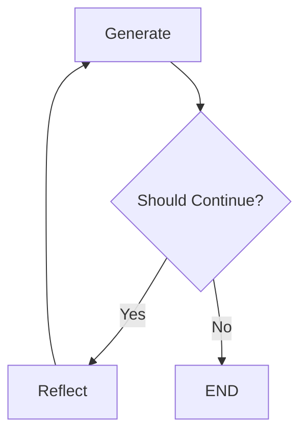

# 🚀 Portfólio de IA e LangGraph - Transição de Carreira

> **Demonstrando competências práticas em Inteligência Artificial, Agentes Autônomos e Desenvolvimento de Sistemas Inteligentes**

Este repositório representa minha jornada de **transição de carreira** para a área de **Inteligência Artificial**, apresentando projetos práticos que demonstram domínio de conceitos fundamentais e tecnologias emergentes em IA.

---

## 🎯 **Sobre Este Portfólio**

Como profissional em **transição de carreira**, este repositório documenta meu aprendizado e aplicação prática de:
- **Agentes de IA Autônomos** com capacidade de raciocínio e tomada de decisão
- **Sistemas de Reflexão** para melhoria iterativa de resultados
- **Integração de APIs** complexas (Gmail, Tavily, Google AI)
- **Arquiteturas de Grafos** para workflows inteligentes
- **Interfaces Modernas** com Streamlit para demonstração

---

## 🛠️ **Stack Tecnológico Demonstrado**

| **Categoria** | **Tecnologias** | **Aplicação** |
|---------------|-----------------|---------------|
| **IA/ML** | Google Gemini 2.0 Flash, LangChain, LangGraph | Modelos de linguagem e orquestração |
| **Agentes** | ReAct Pattern, Tool Calling, State Management | Agentes autônomos inteligentes |
| **APIs** | Gmail API, Tavily Search, OAuth2 | Integrações complexas |
| **Frontend** | Streamlit, CSS customizado | Interfaces interativas |
| **Backend** | Python, Pydantic, Type Hints | Código estruturado e tipado |
| **DevOps** | Virtual Environments, Requirements Management | Boas práticas de desenvolvimento |

---

## 📂 **Projetos e Competências Demonstradas**

### 🔥 **1. Agentes ReAct com Busca em Tempo Real**
**Pasta:** `1_helloworld/`

**Conceitos de IA Aplicados:**
- **Padrão ReAct** (Reasoning, Acting, Observing)
- **Tool Calling** dinâmico
- **Integração de APIs** em tempo real
- **Processamento de linguagem natural**

**Tecnologias:**
- LangGraph para orquestração de agentes
- Google Gemini 2.0 Flash como LLM
- Tavily Search para dados em tempo real
- Ferramentas customizadas (datetime)

**Funcionalidades Implementadas:**
```python
# Agente capaz de:
- Buscar informações atualizadas na web
- Processar consultas em linguagem natural
- Tomar decisões sobre quais ferramentas usar
- Retornar respostas contextualizadas
```

**Demonstra:** Capacidade de criar agentes inteligentes que interagem com o mundo real.

---

### 🧠 **2. Sistema de Reflexão e Auto-Melhoria**
**Pasta:** `2_basic_reflection_system/`

**Conceitos de IA Aplicados:**
- **Self-Reflection** em sistemas de IA
- **Iterative Improvement** automático
- **Message Graphs** para controle de fluxo
- **Conditional Logic** baseada em estado

**Arquitetura Implementada:**


**Tecnologias:**
- LangGraph MessageGraph
- Chains customizadas para geração e reflexão
- Prompt Engineering avançado
- Visualização de grafos (Mermaid + ASCII)

**Funcionalidades Implementadas:**
- **Geração de conteúdo** inicial
- **Análise crítica** automática
- **Refinamento iterativo** baseado em feedback
- **Controle de qualidade** por número de iterações

**Demonstra:** Compreensão de sistemas de IA que se auto-aprimoram.

---

### 📧 **3. Assistente Pessoal Completo com Gmail**
**Pasta:** `3_gmail_assistant_chatbot/`

**Conceitos de IA Aplicados:**
- **Multi-Agent Systems** com ferramentas especializadas
- **State Management** complexo
- **Tool Orchestration** inteligente
- **Natural Language Understanding** para comandos

**Arquitetura do Sistema:**
```python
# 5 Ferramentas Gmail Integradas:
1. GmailSendMessage     # Envio de emails
2. GmailCreateDraft     # Criação de rascunhos  
3. GmailSearch          # Busca inteligente
4. GmailGetMessage      # Leitura de mensagens
5. GmailGetThread       # Gerenciamento de threads
```

**Tecnologias:**
- **LangGraph StateGraph** para workflows complexos
- **OAuth2** para autenticação segura
- **Gmail API** com escopo completo
- **Streamlit** para interface profissional
- **Error Handling** robusto

**Funcionalidades Implementadas:**
- Interface web moderna e responsiva
- Autenticação OAuth2 automática
- Processamento de comandos em linguagem natural
- Execução de ações Gmail baseada em intenção
- Histórico de conversação persistente
- Status de ferramentas em tempo real

**Demonstra:** Capacidade de integrar IA com sistemas empresariais reais.

---

### 📊 **4. Saídas Estruturadas com Pydantic**
**Pasta:** `4_types/`

**Conceitos de IA Aplicados:**
- **Structured Output** de LLMs
- **Data Validation** automática
- **Type Safety** em sistemas de IA
- **Schema-Driven Development**

**Tecnologias:**
- Pydantic para validação de dados
- Type Hints para código robusto
- Structured Output do Gemini
- Modelos de dados customizados

**Funcionalidades Implementadas:**
```python
class Country(BaseModel):
    name: str = Field(description="Nome do país")
    language: str = Field(description="Idioma principal")
    capital: str = Field(description="Capital")

# LLM retorna dados estruturados e validados
```

**Demonstra:** Compreensão de como garantir qualidade e estrutura em outputs de IA.

---

### 🔄 **5. Sistema de Reflexão Avançado**
**Pasta:** `5_basic_reflexion_system/`

**Status:** Em desenvolvimento - Explorando conceitos avançados de auto-reflexão

---

## 🎨 **Interface e Experiência do Usuário**

### **Streamlit App Principal** (`streamlit_app.py`)
- **Visualização interativa** do sistema de reflexão
- **Execução controlada** de workflows
- **Análise detalhada** de resultados
- **Representação gráfica** dos fluxos (Mermaid + ASCII)

### **Gmail Assistant Interface** (`3_gmail_assistant_chatbot/app.py`)
- **Design moderno** com CSS customizado
- **Sidebar informativo** com status de configuração
- **Exemplos de uso** integrados
- **Feedback visual** para operações

---

## 🚀 **Como Executar os Projetos**

### **Setup Inicial**
```bash
# 1. Clone o repositório
git clone https://github.com/seu-usuario/lgraph.git
cd lgraph

# 2. Crie ambiente virtual
python -m venv venv
venv\Scripts\activate  # Windows
# source venv/bin/activate  # Linux/Mac

# 3. Instale dependências
pip install -r requirements.txt
```

### **Configuração de APIs**
```bash
# Crie arquivo .env na raiz:
GOOGLE_API_KEY=sua_chave_google_ai_studio
TAVILY_API_KEY=sua_chave_tavily_search
```

### **Execução dos Projetos**
```bash
# Agente ReAct básico
cd 1_helloworld && python lg_real.py

# Sistema de reflexão (interface)
streamlit run streamlit_app.py

# Assistente Gmail completo
cd 3_gmail_assistant_chatbot && streamlit run app.py

# Saídas estruturadas
cd 4_types && python structured_output.py
```

---

## 💡 **Conceitos de IA Demonstrados**

### **🤖 Agentes Autônomos**
- **ReAct Pattern**: Reasoning → Acting → Observing
- **Tool Selection**: Escolha inteligente de ferramentas
- **Decision Making**: Tomada de decisão baseada em contexto

### **🧠 Sistemas Cognitivos**
- **Self-Reflection**: Auto-análise e melhoria
- **Iterative Refinement**: Refinamento baseado em feedback
- **Quality Control**: Controle de qualidade automático

### **🔗 Orquestração Complexa**
- **State Management**: Gerenciamento de estado persistente
- **Workflow Orchestration**: Orquestração de fluxos complexos
- **Conditional Logic**: Lógica condicional avançada

### **🛠️ Integração de Sistemas**
- **API Integration**: Integração com APIs reais
- **Authentication**: Autenticação OAuth2 segura
- **Error Handling**: Tratamento robusto de erros

---

## 📈 **Progressão de Aprendizado Demonstrada**

1. **Fundamentos** → Agentes básicos e ferramentas simples
2. **Sistemas Intermediários** → Reflexão e melhoria iterativa  
3. **Aplicações Avançadas** → Assistentes completos com APIs reais
4. **Estruturação de Dados** → Outputs validados e tipados
5. **Sistemas Complexos** → Workflows multi-agente (em desenvolvimento)

---

## 🎯 **Competências para Recrutadores**

### **Técnicas**
✅ **Python Avançado** - Type hints, Pydantic, async/await  
✅ **Arquitetura de Software** - Padrões de design, modularização  
✅ **APIs e Integrações** - OAuth2, REST APIs, error handling  
✅ **IA/ML** - LLMs, agentes, prompt engineering  
✅ **Frontend** - Streamlit, CSS, UX design  

### **Conceituais**
✅ **Sistemas Inteligentes** - Agentes autônomos, tomada de decisão  
✅ **Processamento de Linguagem** - NLP, compreensão de intenção  
✅ **Arquiteturas Cognitivas** - Reflexão, auto-melhoria  
✅ **Integração Empresarial** - Sistemas reais, segurança  
✅ **Experiência do Usuário** - Interfaces intuitivas, feedback  

### **Metodológicas**
✅ **Desenvolvimento Iterativo** - Prototipagem rápida  
✅ **Documentação Técnica** - READMEs detalhados, comentários  
✅ **Boas Práticas** - Versionamento, ambientes virtuais  
✅ **Resolução de Problemas** - Debugging, troubleshooting  
✅ **Aprendizado Contínuo** - Exploração de novas tecnologias  

---

## 🔮 **Próximos Passos**

- [ ] **Sistema Multi-Agente** com especialização de papéis
- [ ] **RAG (Retrieval-Augmented Generation)** com base de conhecimento
- [ ] **Fine-tuning** de modelos para casos específicos
- [ ] **Deploy em Cloud** (AWS/GCP/Azure)
- [ ] **Monitoramento e Métricas** de performance
- [ ] **Testes Automatizados** para sistemas de IA

---

## 📞 **Contato**

**Desenvolvido por:** [Seu Nome]  
**LinkedIn:** [Seu LinkedIn]  
**Email:** [Seu Email]  
**GitHub:** [Seu GitHub]

> 💼 **Aberto a oportunidades** em IA, Machine Learning, Desenvolvimento de Agentes e Sistemas Inteligentes.

---

## 📄 **Licença**

Este projeto está sob a licença MIT - veja o arquivo [LICENSE](LICENSE) para detalhes.

---

**🎓 Este portfólio demonstra não apenas conhecimento técnico, mas também capacidade de aplicar conceitos de IA em soluções práticas e escaláveis.**